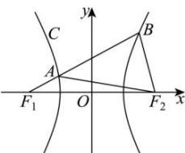

> [!faq]- 全练一本通解析
> **【答案】** 2
>
> **【解析】**
> 设 $|AF_1| = m$ ，则 $|AB| = \frac{8}{3} m,|BF_1| = \frac{11}{3} m$ ，由双曲线定义得 $|AF_2| = 2a + m,|BF_2| = \frac{11}{3} m - 2a$ 在△ABF中，由余弦定理得 $(\frac{8}{3} m)^2 +(\frac{11}{3} m - 2a)^2 -2\times \frac{8}{3} m\times (\frac{11}{3} m - 2a)\times \frac{1}{4} = (2a + m)^2$ 解得 $m = \frac{12}{11} a$ ，因此 $|BF_1| = 4a,|BF_2| = 2a$ ，令双曲线的半焦距为 $c,$ 在△F1BF中，由余弦定理得 $(4a)^2 +(2a)^2 -2\times 4a\times 2a\times \frac{1}{4} = (2c)^2$ ，解得 $c = 2a$ ，所以双曲线 $C$ 的离心率为 $e = \frac{c}{a} = 2$ ：
> 
