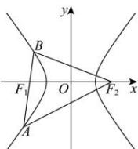

> [!faq]- 全练一本通解析
> **【解析】**
> $\frac{\sqrt{21}}{3}$ 解析:如图,由于 $\left|AF_{1}\right|=2\left|F_{1}B\right|,\left|AB\right|=\left|BF_{2}\right|$ ,
> 且 $\left|BF_{2}\right|-\left|BF_{1}\right|=2a,\left|AF_{2}\right|-\left|AF_{1}\right|=2a$ 设 $\left|BF_{1}\right|=m$ ，则 $\left|AF_{1}\right|=2m$ ，故 $\left|BF_{2}\right|=3m$ 可得 $m=a,\left|BF_{1}\right|=a,\left|AF_{1}\right|=2a$ ，故 $\left|BF_{2}\right|=3a,\left|AF_{2}\right|=4a$ 在 $\triangle BF_{1}F_{2}$ 与 $\triangle BAF_{2}$ 中由余弦定理可得： $\frac{a^{2}+9a^{2}-4}{2\times a\times3a}=\frac{9a^{2}+9a^{2}-16a^{2}}{2\times3a\times3a}$ ，解得 $a^{2}=\frac{3}{7}$ ，故 $a=\frac{\sqrt{21}}{7}$ 又根据题意可知 c=1，故离心率 $e=\frac{c}{a}=\frac{\sqrt{21}}{3}$
> 
