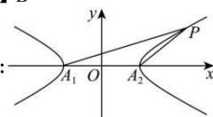

> [!faq]- 全练一本通解析
> **【答案】** B
>
> **【解析】**
> 
> 如图， $A_{1}(-a,0),A_{2}(a,0)$ ，设 $P(x,y)$ ，则直线 $PA_{1}$ ， $PA_{2}$ 的斜率分别为： $k_{P,A_1} = \frac{y}{x + a}, k_{P,A_2} = \frac{y}{x - a},$
> 因 $\frac{x^2}{a^2} -\frac{y^2}{b^2} = 1$ ，故有 $y^{2} = b^{2}\left(\frac{x^{2}}{a^{2}} -1\right)$ 则 $k_{P_{A_1}}\cdot k_{P_{A_2}} = \frac{y}{x + a}\cdot \frac{y}{x - a} = \frac{y^2}{x^2 - a^2} = \frac{b^2(\frac{x^2}{a^2} -1)}{x^2 - a^2} = \frac{b^2}{a^2} = 4,$ 于是， $e^2 = \frac{c^2}{a^2} = \frac{a^2 + b^2}{a^2} = 1 + 4 = 5.$ 故 $e = \sqrt{5}$ .
>
> 故选 **B**.
