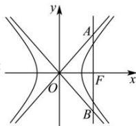

> [!faq]- 全练一本通解析
> **【答案】** A
>
> **【解析】**
> 
> 由题知, 双曲线的渐近线为 $y = \pm \frac{b}{a} x$ ,
> 得 $A\left(c,\frac{bc}{a}\right), B\left(c,-\frac{bc}{a}\right)$ , $\therefore |AB|=\frac{2bc}{a}$ $\therefore S_{\triangle AOB}=\frac{1}{2}|OF|\cdot|AB|=\frac{1}{2}c\times\frac{2bc}{a}=\frac{\sqrt{3}c^{2}}{3}$ $\therefore \frac{b}{a} = \frac{\sqrt{3}}{3}$ $\therefore e=\frac{c}{a}=\sqrt{1+\left(\frac{b}{a}\right)^{2}}=\sqrt{1+\left(\frac{\sqrt{3}}{3}\right)^{2}}=\frac{2\sqrt{3}}{3}$ ，
>
> 故选 **A**.
