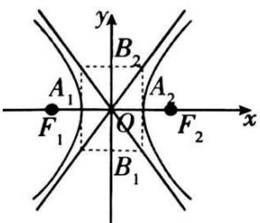
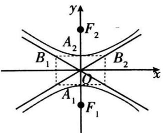

## 1. 双曲线的简单几何性质

<table><tr><td>标准方程</td><td colspan="2"> $\frac{x^2}{a^2}-\frac{y^2}{b^2}=1(a>0,b>0)$ </td><td colspan="2"> $\frac{y^2}{a^2}-\frac{x^2}{b^2}=1(a>0,b>0)$ </td></tr><tr><td>图形</td><td></td><td></td><td></td><td></td></tr><tr><td>焦点</td><td colspan="2"> $F_1(-c,0), F_2(c,0)$ </td><td colspan="2"> $F_1(0,-c), F_2(0,c)$ </td></tr><tr><td>a,b,c的关系</td><td colspan="4"> $c^2=a^2+b^2$ </td></tr><tr><td>范围</td><td colspan="2">x≥a或x≤-a,y∈R</td><td colspan="2">y≥a或y≤-a,x∈R</td></tr><tr><td>对称性</td><td colspan="4">关于x轴、y轴对称,关于原点中心对称</td></tr><tr><td>顶点</td><td colspan="2"> $A_1(-a,0), A_2(a,0)$ </td><td colspan="2"> $A_1(0,-a), A_2(0,a)$ </td></tr><tr><td>轴</td><td colspan="4">实轴长为2a,虚轴长为2b;实半轴长为a,虚半轴长为b</td></tr><tr><td rowspan="2">离心率</td><td colspan="4"> $e=\frac{c}{a}=\sqrt{1+\frac{b^2}{a^2}} \quad (e>1)$ </td></tr><tr><td colspan="4">e也越大,双曲线开口就越开阔.所以离心率可以用来表示双曲线开口的大小程度.</td></tr><tr><td>渐近线方程</td><td colspan="2"> $y=\pm\frac{b}{a}x$ </td><td colspan="2"> $y=\pm\frac{a}{b}x$ </td></tr></table>
