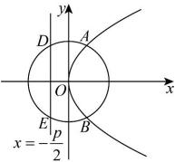

> [!faq]- 全练一本通解析
> **【解析】**
> $y^{2}=4x$
> 解析:依题意, 易知圆心 O 到直线 DE （即抛物线 C 的准线 $x=-\frac{p}{2}$ ）的距离为 $d_{1}=\frac{p}{2}$ ,
> 不妨设圆心 O 到直线 AB 的距离为 $d_{2}$ 则 $\left|AB\right|=2\sqrt{r^{2}-d_{2}^{2}}$ ， $\left|DE\right|=2\sqrt{r^{2}-d_{1}^{2}}$ 又因为 $\left|AB\right|=\left|DE\right|=4$ ，所以 $d_{2}=d_{1}=\frac{p}{2}$ 则由圆与抛物线的对称性可知， $AB \perp x$ 轴，
> 故直线 AB 的方程为 $x=\frac{p}{2}$ ，即过抛物线 C 的焦点 $\left(\frac{p}{2},0\right)$ 所以 $\left|AB\right|=x_{A}+x_{B}+p=\frac{p}{2}+\frac{p}{2}+p=2p=4$ ，故 p=2，
> 故抛物线 C 的方程为 $y^{2}=4x$ .
> 
