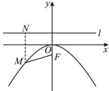

> [!faq]- 全练一本通解析
> **【答案】** （1） $m=\pm2\sqrt{6}$ ，抛物线方程为 $x^{2}=-8y$ ，准线方程为y=2； (2) $y^{2}=4\sqrt{2}x$ 或 $y^{2}=-4\sqrt{2}x$ ; (3) $y^{2}=3x$ 或 $y^{2}=-3x$ .
>
> **【解析】**
> (1) 因为顶点在原点, 焦点在 y 轴上, 点 $M(m,-3)$ 位于第三或第四象限, 故可确定所求抛物线的开口向下.
> 
> 如图所示, 设抛物线方程为 $x^{2} = -2py(p > 0)$ ，则焦点为 $F\left(0, -\frac{p}{2}\right)$ ，准线 $l: y = \frac{p}{2}$ ，
> 过点 M 作 $MN \perp l$ ，垂足为 N，则 $\left|MN\right|=\left|MF\right|=5$ ，
> 而 $\left|MN\right|=3+\frac{p}{2}$ ，所以 $3+\frac{p}{2}=5$ ，解得 p=4。
> 又点 M 在抛物线上，所以 $m^{2}=24$ ，解得 $m=\pm2\sqrt{6}$ 故 $m=\pm2\sqrt{6}$ ，抛物线方程为 $x^{2}=-8y$ ，准线方程为 y=2。
> （2）由题意，可设抛物线的方程为 $y^{2}=2px\left(p\neq0\right)$ ，则焦点为 $F\left(\frac{p}{2},0\right)$ ，直线 $l: x=\frac{p}{2}$ ，
> 所以直线 l 与抛物线的交点的坐标分别为 $\left(\frac{p}{2}, p\right), \left(\frac{p}{2}, -p\right)$ ，所以 $\left|AB\right|=2\left|p\right|$ .
> 因为 $\triangle OAB$ 的面积为 4, 所以 $\frac{1}{2}\cdot\frac{\left|p\right|}{2}\cdot2\left|p\right|=4$ ，所以 $p=\pm2\sqrt{2}$ .
> 故所求抛物线的标准方程为 $y^{2}=4\sqrt{2}x$ 或 $y^{2}=-4\sqrt{2}x$ .
> （3）由题意设所求抛物线的方程为 $y^{2}=2py(p>0)$ 或 $y^{2}=-2px(p>0)$ ，抛物线与圆的交点 $A(x_{1},y_{1})$ ， $B(x_{2},y_{2})(y_{1}>0,y_{2}<0)$ ，
> 由对称性，知 $x_{1}=x_{2}$ ， $y_{1}=-y_{2}$ ，
> 则 $\left|y_{1}\right|+\left|y_{2}\right|=2\sqrt{3}$ ，即 $y_{1}-y_{2}=2y_{1}=2\sqrt{3}$ ，得 $y_{1}=\sqrt{3}$ 将 $y_{1}=\sqrt{3}$ 代入 $x^{2}+y^{2}=4$ ，解得 $x_{1}=\pm1$ .
> 所以点 $(1,\sqrt{3})$ 在抛物线 $y^{2}=2px(p>0)$ 上，点 $(-1,\sqrt{3})$ 在抛物线 $y^{2}=-2px(p>0)$ 上，求得 $p=\frac{3}{2}$ . 故抛物线方程为 $y^{2}=3x$ 或 $y^{2}=-3x$ .
> ## 重点题型专练
