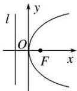
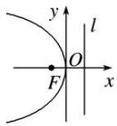
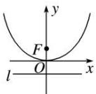
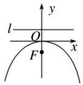

## 1. 四种抛物线的几何性质

<table><tr><td>标准方程</td><td> $y^{2}=2px(p>0)$ </td><td> $y^{2}=-2px(p>0)$ </td><td> $x^{2}=2py(p>0)$ </td><td> $x^{2}=-2py(p>0)$ </td></tr><tr><td>图形</td><td></td><td></td><td></td><td></td></tr><tr><td>范围</td><td> $x\geq 0,y\in R$ </td><td> $x\leq 0,y\in R$ </td><td> $y\geq 0,x\in R$ </td><td> $y\leq 0,x\in R$ </td></tr><tr><td>对称轴</td><td colspan="2">y=0</td><td colspan="2">x=0</td></tr><tr><td>焦点坐标</td><td> $F\left(\frac{p}{2},0\right)$ </td><td> $F\left(-\frac{p}{2},0\right)$ </td><td> $F\left(0,\frac{p}{2}\right)$ </td><td> $F\left(0,-\frac{p}{2}\right)$ </td></tr><tr><td>准线方程</td><td> $x=-\frac{p}{2}$ </td><td> $x=\frac{p}{2}$ </td><td> $y=-\frac{p}{2}$ </td><td> $y=\frac{p}{2}$ </td></tr><tr><td>顶点坐标</td><td colspan="4">O(0,0)</td></tr><tr><td>离心率</td><td colspan="4">e=1</td></tr><tr><td>通径</td><td colspan="4">2p</td></tr></table>
