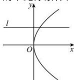

> [!faq]- 全练一本通解析
> **【答案】** B
>
> **【解析】**
> 解析: 当“l 与 C 只有一个公共点”时, 如图,解析: 当 l 与 C 只有一个公共点时, 如图,
> 直线与抛物线的对称轴平行, 与抛物线只有一个公共点,
> 但是此时 l 与 C 不相切. 所以“l 与 C 只有一个公共点”是“l 与 C 相切”的不充分条件;
> 
> 当“l 与 C 相切”时，l 与 C 只有一个公共点，所以“l 与 C 只有一个公共点”是“l 与 C 相切”的必要条件.
> 综上，“l 与 C 只有一个公共点”是“l 与 C 相切”的必要不充分条件.
>
> 故选 **B**
