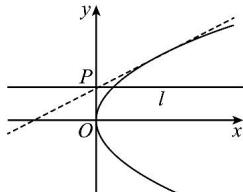

> [!faq]- 全练一本通解析
> **【答案】** ABC
>
> **【解析】**
> 解析：（1）当过点 $P(0,1)$ 的直线 l 的斜率存在时，设其方程为 $y=kx+1$ ，
> 由方程组 $\left\{\begin{aligned}y^{2}&=2x\\ y&=kx+1\end{aligned}\right.$ 消去 y 得 $k^{2}x^{2}+(2k-2)x+1=0$ ①若 k=0，则 $-2x+1=0$ ，解得 $x=\frac{1}{2}$ ，
> 此时直线与抛物线只有一个交点，直线 l 的方程为 y=1，A 正确；
> - **②**：若 $k \neq 0$ ，令 $\Delta = (2k - 2)^{2} - 4k^{2} = 0$ ，解得 $k = \frac{1}{2}$ ，
> 此时直线与抛物线相切，只有一个交点，
> 直线 l 的方程为 $y=\frac{1}{2}x+1$ ，即 $x-2y+2=0$ ，B 正确.
> （2）当过点 $P(0,1)$ 的直线 l 的斜率不存在时，方程为 x=0，
> 综上, 直线 l 的方程为 y=1, $x-2y+2=0$ 或 x=0. 故选: ABC.
> 
