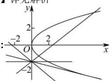

> [!faq]- 全练一本通解析
> **【解析】**
> 详见解析
> 
> 若直线 l 斜率不存在, 此时 l 为 y 轴, 与抛物线有且仅有一个交点 $(0,0)$ ;
> 若直线 l 的斜率存在, 记为 k, 则可设直线 l 的方程为: y = kx - 2,
> 由 $\left\{\begin{aligned}y=kx-2\\ y^{2}=2x\end{aligned}\right.$ 得: $k^{2}x^{2}-(4k+2)x+4=0$ ;
> - **①**：当 k=0 时， $k^{2}x^{2}-(4k+2)x+4=-2x+4=0$ ，解得：x=2，此时 y=-2，
> ∴ 直线 l 与抛物线有且仅有一个公共点 $(2,-2)$ ②当 $k \neq 0$ 时，方程 $k^{2}x^{2}-(4k+2)x+4=0$ 的判别式 $\Delta=(4k+2)^{2}-16k^{2}=16k+4$ 若 $\Delta<0$ ，即 $k<-\frac{1}{4}$ ，方程 $k^{2}x^{2}-(4k+2)x+4=0$ 无实根，则直线 l 与抛物线无交点；
> 若 $\Delta=0$ ，即 $k=-\frac{1}{4}$ ，方程 $k^{2}x^{2}-(4k+2)x+4=0$ 有两个相等实根，则直线 l 与抛物线相切，有且仅有一个公共点；
> 若 $\Delta>0$ ，即 $k > -\frac{1}{4}$ 且 $k \neq 0$ 时，方程 $k^{2}x^{2}-(4k+2)x+4=0$ 有两个不等实根, 则直线 l 与抛物线有两个不同交点;
> 综上所述: 当直线 l 斜率不存在或直线 l 斜率 k=0 或 $-\frac{1}{4}$ 时, 直线 l 与抛物线有且仅有一个公共点; 当直线 l 斜率 $k<-\frac{1}{4}$ 时, 直线 l 与抛物线无公共点; 当直线 l 斜率 $k>-\frac{1}{4}$ 且 $k\neq0$ 时, 直线 l 与抛物线有两个公共点.
