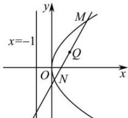

> [!faq]- 全练一本通解析
> **【答案】** $2x - y - 1 = 0$
>
> **【解析】**
> 因为抛物线 C 的顶点为坐标原点，准线为 $x = -1$ ，所以易得抛物线的方程为 $y^{2} = 4x$ ，设 $M(x_{1},y_{1}),N(x_{2},y_{2})$ ，因为线段 MN 的中点为 $Q(1,1)$ ，故 $x_{1} + x_{2} = 2,y_{1} + y_{2} = 2$ ，则 $x_{1} \neq x_{2}$ ，由 $\left\{\begin{aligned}y_{1}^{2}&=4x_{1}\\ y_{2}^{2}&=4x_{2}\end{aligned}\right.$ ，两式相减得 $y_{1}^{2}-y_{2}^{2}=4(x_{1}-x_{2})$ ，所以 $\frac{y_{1}-y_{2}}{x_{1}-x_{2}}=\frac{4}{y_{1}+y_{2}}=2$ ，故直线 l 的方程为 $y-1=2(x-1)$ ，即 $2x-y-1=0$ ．故答案为： $2x-y-1=0$ ．
> 
