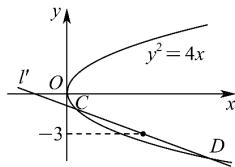

> [!faq]- 全练一本通解析
> **【答案】** （1）证明见解析；（2） $-\frac{2}{3}$
>
> **【解析】**
> （1）因为 M 的焦点为 $\left(\frac{p}{2},0\right)$ ,
> 且直线 l: y = 2x - p 经过点 $\left(\frac{p}{2},0\right)$ ，所以 l 经过 M 的焦点.
> 联立 $\left\{\begin{aligned}y^{2}&=2px\\ y&=2x-p\end{aligned}\right.$ ，得 $4x^{2}-6px+p^{2}=0$ .
> 设 $A(x_{1},y_{1})$ ， $B(x_{2},y_{2})$ ，则 $x_{1}+x_{2}=\frac{3p}{2}$ ，
> 则 $\left|AB\right|=x_{1}+x_{2}+p=\frac{5p}{2}=5$ ，解得 p=2。
> 所以 M 的方程为 $y^{2}=4x$ .
> （2）设 $C(x_{3},y_{3})$ ， $D(x_{4},y_{4})$ ，则 $\left\{\begin{aligned}y_{3}^{2}&=4x_{3}\\ y_{4}^{2}&=4x_{4}\end{aligned}\right.$ 两式相减，得 $(y_{3}-y_{4})(y_{3}+y_{4})=4(x_{3}-x_{4})$ 因为 $y_{3} + y_{4} = 2 \times (-3) = -6$ 所以 $l'$ 的斜率为 $\frac{y_{3}-y_{4}}{x_{3}-x_{4}}=\frac{4}{y_{3}+y_{4}}=\frac{4}{-6}=-\frac{2}{3}$
> 
