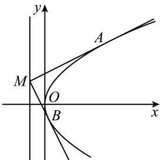

<!-- question-source:start -->
【26】已知抛物线 C: $y^{2}=2px(p>0)$ 的焦点 F 与椭圆 $\frac{x^{2}}{4}+\frac{y^{2}}{3}=1$ 的右焦点重合, 点 M 是抛物线 C 的准线上任意一点, 直线 MA, MB 分别与抛物线 C 相切于点 A, B.

（2）设直线 $MA, MB$ 的斜率分别为 $k_{1}, k_{2}$ ，证明： $k_{1} \cdot k_{2}$ 为定值.

<!-- question-source:end -->
