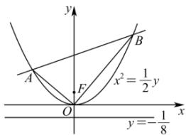

> [!faq]- 全练一本通解析
> **【答案】** 详见解析
>
> **【解析】**
> （1）设点 $P(x,y)$ ，则 $\sqrt{(x-0)^{2}+(y-\frac{1}{8})^{2}}=\left|y+\frac{1}{8}\right|$ ，平方并整理得 $x^{2}=\frac{1}{2}y$ ∴ 曲线 C 的方程为 $x^{2}=\frac{1}{2}y$ .
> （2）证明：由题意可知直线 AB 的斜率一定存在，否则不与曲线 C 有两个交点.
> 
> 设 AB 的方程为 $y = kx + m (m \neq 0)$ ， $A(x_{1}, y_{1}), B(x_{2}, y_{2})$ ，联立 $\left\{\begin{aligned} y &= kx + m, \\ y &= 2x^{2}, \end{aligned}\right.$ 得 $2x^{2}-kx-m=0$ ，其中 $\Delta=k^{2}+8m>0$ ，则 $x_{1}+x_{2}=\frac{k}{2}$ ， $x_{1}x_{2}=-\frac{m}{2}$ ，
> 由 $x^{2}=\frac{1}{2}y$ ，得 $y_{1}=2x_{1}^{2}$ ， $y_{2}=2x_{2}^{2}$ .
> ∴ $y_{1}y_{2}=2x_{1}^{2}\cdot2x_{2}^{2}=4(x_{1}x_{2})^{2}=4\times\left(-\frac{m}{2}\right)^{2}=m^{2}$ .
> ∵ 直线 AB 过 $\triangle OAB$ 的外心，∴ $OA \perp OB$ .
> ∴ $\overrightarrow{OA} \cdot \overrightarrow{OB} = x_{1} x_{2} + y_{1} y_{2} = 0$ ，即 $-\frac{m}{2} + m^{2} = 0$ ，解得 $m = \frac{1}{2}$ 或 m = 0（舍去）.
> 当 $m=\frac{1}{2}$ 时，满足 $\Delta>0$ . ∴ 直线 AB 的方程为 $y=kx+\frac{1}{2}$ ,
> ∴ 直线 AB 过定点 $\left(0,\frac{1}{2}\right)$ .
