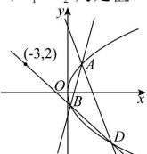

> [!faq]- 全练一本通解析
> **【答案】** （1） $y^{2} = 4x$ ；（2）证明见解析
>
> **【解析】**
> （1）设圆心 $C(x,y)$ ，半径为 $r$ ，由圆心为 $C$ 的动圆过点(2,0)，所以 $(x - 2)^{2} + y^{2} = r^{2}$ 又圆心为 $C$ 的动圆在 $y$ 轴上截得的弦长为4，所以 $x^{2} + 2^{2} = r^{2}$ 此时 $(x - 2)^{2} + y^{2} = x^{2} + 4$ ，解得 $y^{2} = 4x$ 所以曲线 $E$ 是抛物线，其方程为 $y^{2} = 4x$ （2）易知直线 $BD$ 的斜率不为0，设直线 $BD$ 的方程为 $x + 3 = t(y - 2)$ ，即 $x = ty - 2t - 3$ ， $\left\{ \begin{array}{l}x = ty - 2t - 3\\ y^2 = 4x \end{array} \right.$ ，消去 $x$ ，得 $y^{2} - 4ty + 8t + 12 = 0$ ， $\Delta = 16t^2 -4(8t + 12) > 0\Rightarrow t <   - 1$ 或 $t > 3$ 设 $B(x_{1},y_{1}),D(x_{2},y_{2})$ ，则 $y_{1} + y_{2} = 4t,y_{1}y_{2} = 8t + 12$ ， $k_{1} = \frac{y_{1} - 2}{x_{1} - 1} = \frac{y_{1} - 2}{\frac{y_{1}^{2}}{4} - 1} = \frac{4}{y_{1} + 2},k_{2} = \frac{y_{2} - 2}{x_{2} - 1} = \frac{y_{2} - 2}{\frac{y_{2}^{2}}{4} - 1} = \frac{4}{y_{2} + 2}$ 所以 $k_{1} + k_{2} = \frac{4}{y_{1} + 2} +\frac{4}{y_{2} + 2} = \frac{4(y_{1} + y_{2} + 4)}{(y_{1} + 2)(y_{2} + 2)} = \frac{4(y_{1} + y_{2}) + 16}{y_{1}y_{2} + 2(y_{1} + y_{2}) + 4} = \frac{16t + 16}{16t + 16} = 1$ 即 $k_{1} + k_{2}$ 为定值1
> $$
> k _ {1} + k _ {2}
> $$
> 
