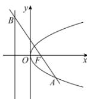
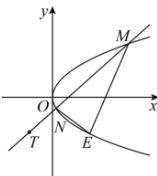

> [!faq]- 全练一本通解析
> **【答案】** 详见解析
>
> **【解析】**
> （1）如图所示：
> 
> 由题意可知, 因为 $\overrightarrow{BF}=2\overrightarrow{FA}$ , $\left|AF\right|=\frac{1}{3}\left|AB\right|=3$ ,
> 由 $\overrightarrow{BF}=2\overrightarrow{FA}$ ， $x_{B}=-\frac{p}{2}$ ， $x_{F}=\frac{p}{2}$ 可得 $x_{A}=p$ 由抛物线的定义可知， $\left|AF\right|=p+\frac{p}{2}=3$ ，解得 p=2.
> 则 C 的方程为 $y^{2}=4x$ .
> (2) 如图所示:
> 
> $E(x_{0},-2)$ 在抛物线 C 上, 所以 $x_{0}=1$ ,
> 设直线 MN 的方程为 $x=ty+n$ ， $M(x_{1},y_{1})$ ， $N(x_{2},y_{2})$ ，
> 将 $x=ty+n$ 代入 $y^{2}=4x$ ，得 $y^{2}-4ty-4n=0$ 则 $y_{1}+y_{2}=4t$ ， $y_{1}y_{2}=-4n$ $k_{EM}=\frac{y_{1}+2}{x_{1}-1}=\frac{y_{1}+2}{\frac{y_{1}^{2}}{4}-1}=\frac{4}{y_{1}-2}$ ，同理 $k_{EN}=\frac{4}{y_{2}-2}$ $k_{EM} + k_{EN} = \frac{4}{y_{1}-2} + \frac{4}{y_{2}-2} = \frac{4(y_{1} + y_{2}) - 16}{y_{1}y_{2} - 2(y_{1} + y_{2}) + 4} = \frac{16t - 16}{-4n - 8t + 4} = 1$ 整理得， $n=-6t+5$ 直线 MN 的方程为 x=ty-6t+5，所以直线 MN 过定点 T(5,6).
> 当 ET ± MN 时，点 E 到直线 MN 距离最大，
> 且最大距离为 $\left|ET\right|=\sqrt{\left(5-1\right)^{2}+\left(6+2\right)^{2}}=4\sqrt{5}$ 经检验符合题意.
