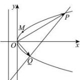

> [!faq]- 全练一本通解析
> **【解析】**
> （1） $C:y^{2}=2x$ （2）直线l过定点(3,0)
> 解析：（1）依题意可得 $\left\{\begin{aligned}&2pm=1\\ &m+\frac{p}{2}=1\end{aligned}\right.$ ，解得 $\left\{\begin{aligned}m=0.5\\ p=1\end{aligned}\right.$ ，所以抛物线方程为： $C:y^{2}=2x$ ；
> （2）设直线 $l:x=ty+n,t$ 显然存在， $P(x_{1},y_{1}),Q(x_{2},y_{2})$ 联立方程 $\left\{\begin{aligned}y^{2}=2x\\ x=ty+n\end{aligned}\right.$ ，化简可得 $y^{2}-2ty-2n=0$ 所以 $\Delta=4t^{2}+4n>0,y_{1}+y_{2}=2t,y_{1}y_{2}=-2n$ 在抛物线C上，故 $\left\{\begin{aligned}y_{1}^{2}&=2x_{1}\\ y_{2}^{2}&=2x_{2}\end{aligned}\right.$ $\overrightarrow{OP}\cdot\overrightarrow{OQ}=x_{1}x_{2}+y_{1}y_{2}=\frac{1}{4}(y_{1}y_{2})^{2}+y_{1}y_{2}=3\Rightarrow n^{2}-2n-3=0$ ，解得n=-1或n=3，
> 因为 $y_{1}y_{2}<0$ ，所以 $y_{1}y_{2}=-2n\langle0\Rightarrow n\rangle0$ ，得n=3
> 所以直线l过定点(3,0).
> 
