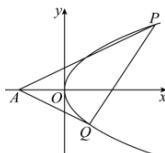

> [!faq]- 全练一本通解析
> **【答案】** 详见解析
>
> **【解析】**
> （1）
> 
> 当点 P 在第一象限时, 设 $P(t,2\sqrt{t}),(t>0)$ ,则 $k_{PA} = \frac{2\sqrt{t} - 0}{t + 2} = \frac{2}{\sqrt{t} + \frac{2}{\sqrt{t}}} \leq \frac{2}{2\sqrt{2}} = \frac{\sqrt{2}}{2}$ ，（当 $t = \sqrt{2}$ 时取等号）， $\therefore k_{PA} \in \left(0, \frac{\sqrt{2}}{2}\right]$ ，
> 同理，当点 $P$ 在第四象限时， $k_{PA} \in \left[-\frac{\sqrt{2}}{2}, 0\right)$ .
> 综上所述，直线 $PA$ 的斜率的取值范围是 $\left[-\frac{\sqrt{2}}{2}, 0\right) \cup \left(0, \frac{\sqrt{2}}{2}\right]$ .
> （2）设直线 $l$ 的方程为 $y = kx + b (k \neq 0)$ ，
> 联立方程 $\left\{ \begin{array}{l} y = kx + b, \\ y^2 = 4x, \end{array} \right.$ 得 $ky^2 - 4y + 4b = 0, \Delta = 16 - 16kb > 0$ ，
> 设 $P(x_1, y_1), Q(x_2, y_2)$ ，则 $y_1 + y_2 = \frac{4}{k}, y_1y_2 = \frac{4b}{k}$ ， $\because \angle PAO = \angle QAO,$ $\therefore k_{AP} + k_{AQ} = \frac{y_1}{x_1 + 2} + \frac{y_2}{x_2 + 2} = \frac{y_1(x_2 + 2) + y_2(x_1 + 2)}{(x_1 + 2)(x_2 + 2)} = 0$ ，
> 即 $y_1(x_2 + 2) + y_2(x_1 + 2) = 0$ ，
> 即 $y_1y_2(y_2 + y_1) + 8(y_1 + y_2) = 0$ ，
> 即 $(y_1 + y_2)(y_1y_2 + 8) = 0$ ，
> 即 $4b + 8k = 0$ ， $\therefore b = -2k$ ，满足 $\Delta > 0$ ， $\therefore y = kx - 2k = k(x - 2)$ ， $\therefore$ 直线 $l$ 过定点 (2,0).
> $$
> (2) \sqrt {2}
> $$
