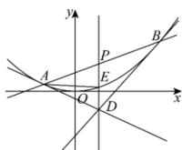

> [!faq]- 全练一本通解析
> **【答案】** （1）证明见解析；（2） $\sqrt{2}$
>
> **【解析】**
> （1）设 $A(x_{1},y_{1})$ ， $B(x_{2},y_{2})$ ， $D(x_{0},y_{0})$ ，由 $x^{2} = 8y$ 得 $y' = \frac{x}{4}$ ，则 $C$ 在点 $A$ 处的切线方程为 $y - y_{1} = \frac{x_{1}}{4}(x - x_{1})$ 将 $x_{1}^{2} = 8y_{1}$ 代入上式得 $x_{1}x = 4y + 4y_{1}$ ， $\therefore x_{1}x_{0} = 4y_{0} + 4y_{1}$ 同理 $x_{2}x_{0} = 4y_{0} + 4y_{2}$ ， $\therefore A, B$ 两点都在直线 $xx_{0} = 4y_{0} + 4y$ 上，所以直线 $xx_{0} = 4y_{0} + 4y$ 与直线 $y = kx + 1$ 同一直线， $\therefore x_{0} = 4k$ ， $y_{0} = -1$ ，即点 $D$ 在定直线 $y = -1$ 上。（2）由（1）可知， $x_{0} = 4k$ ，即 $D$ 为 $(4k, -1)$ ， $\therefore E$ 为 $(4k, 2k^{2})$ 将 $y = kx + 1$ 与 $x^{2} = 8y$ 联立得 $x^{2} - 8kx - 8 = 0, \Delta = 64k^{2} + 32 > 0$ ， $\therefore x_{1} + x_{2} = 8k$ ， $x_{1}x_{2} = -8$ ， $\therefore$ 线段 $AB$ 的中点为 $P(4k, 4k^{2} + 1)$ ， $\therefore D, E, P$ 三点共线，且 $E$ 为 $DP$ 的中点。 $\because |AB| = \sqrt{1 + k^{2}}\sqrt{(x_{1} + x_{2})^{2} - 4x_{1}x_{2}} = 4\sqrt{2}\sqrt{1 + k^{2}}\sqrt{2k^{2} + 1}$ ， $D$ 到直线 $y = kx + 1$ 的距离 $d = \frac{2(2k^{2} + 1)}{\sqrt{1 + k^{2}}}$ ， $\therefore S_{\triangle ABD} = \frac{1}{2}\cdot |AB| \cdot d = 4\sqrt{2}\cdot \sqrt{2k^{2} + 1}\cdot (2k^{2} + 1) \geq 4\sqrt{2}$ （当 $k = 0$ 时取等） $\because S_{\triangle ADE} = \frac{1}{2}S_{\triangle ADP} = \frac{1}{2}\times \frac{1}{2}S_{\triangle ADB} = \frac{1}{4}S_{\triangle ABD}$ ， $\therefore \triangle ADE$ 面积的最小值为 $\sqrt{2}$ ：
> 
