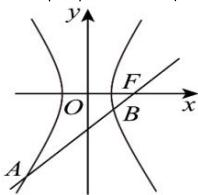

> [!faq]- 全练一本通解析
> **【答案】** （1） $\frac{x^{2}}{3}-\frac{y^{2}}{6}=1$ ；（2） $8\sqrt{3}$
>
> **【解析】**
> （1）由双曲线 $\frac{x^{2}}{a^{2}}-\frac{y^{2}}{b^{2}}=1(a>0,b>0)$ 的焦距为 6，且虚轴长是实轴长的 $\sqrt{2}$ 倍.
> 得 $2c=6$ ，且 $b=\sqrt{2}a$ ，
> 又 $c^{2}=a^{2}+b^{2}=3a^{2}=9$ ，解得 $c=3,a^{2}=3$ ，
> 所以 $b^{2}=c^{2}-a^{2}=9-3=6$ ，
> 所以双曲线方程为 $\frac{x^{2}}{3}-\frac{y^{2}}{6}=1$ .
> （2）由（1）可知双曲线 C 的右焦点 F 为 (3,0)，
> 所以直线 l 的方程为 y=x-3，
> 设 $A(x_{1},y_{1}),B(x_{2},y_{2})$ 由 $\left\{\begin{aligned}\frac{x^{2}}{3}-\frac{y^{2}}{6}=1\\ y=x-3\end{aligned}\right.$ ，得 $x^{2}+6x-15=0$ ，
> 所以 $\left\{\begin{aligned}x_{1}+x_{2}&=-6\\ x_{1}x_{2}&=-15\end{aligned}\right.$ 所以 $\left|AB\right|=\sqrt{1+1^{2}}\cdot\sqrt{(x_{1}+x_{2})^{2}-4x_{1}x_{2}}=\sqrt{2}\cdot\sqrt{36-4\times(-15)}=8\sqrt{3}$
> 
