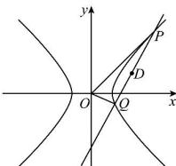

> [!faq]- 全练一本通解析
> **【答案】** （1） $x^{2}-\frac{y^{2}}{4}=1(x\neq\pm1)$ ; （2） $\frac{3}{4}$
>
> **【解析】**
> （1）设点 M 的坐标为 $(x,y)$ ，
> 因为 $k_{AM}=\frac{y}{x-1}$ ， $k_{BM}=\frac{y}{x+1}$ ，所以 $k_{AM}\cdot k_{BM}=\frac{y^{2}}{x^{2}-1}=4$ ，
> 化简得： $x^{2}-\frac{y^{2}}{4}=1$ 所以 E 的方程为： $x^{2}-\frac{y^{2}}{4}=1(x\neq\pm1)$ .
> （2）当直线 PQ 的斜率不存在时，显然不符合题意；
> 设 $P(x_{1},y_{1}), Q(x_{2},y_{2})$ ，直线 PQ 方程为 y=kx-3，
> 
> $y=kx-3$ 与 $x^{2}-\frac{y^{2}}{4}=1$ 联立得： $(4-k^{2})x^{2}+6kx-13=0$ ，
> 由 $\Delta=36k^{2}+52(4-k^{2})>0$ 且 $4-k^{2}\neq0$ ，解得 $k^{2}<13$ 且 $k^{2}\neq4$ ，
> 由韦达定理得 $\left\{\begin{aligned}x_{1}+x_{2}&=\frac{6k}{k^{2}-4}\\ x_{1}x_{2}&=\frac{13}{k^{2}-4}\end{aligned}\right.$ 因为线段 PQ 中点 D 在第一象限，且纵坐标为 $\frac{3}{2}$ ，
> 所以 $\left\{\begin{aligned}x_{1}+x_{2}&=\frac{6k}{k^{2}-4}>0\\ y_{1}+y_{2}&=k(x_{1}+x_{2})-6=\frac{24}{k^{2}-4}=3\end{aligned}\right.$ ，解得 $k=2\sqrt{3}$ 或 $k=-2\sqrt{3}$ （舍去），
> 所以直线 PQ 为 $y=2\sqrt{3}x-3$ ，
> 所以 $\left\{\begin{aligned}x_{1}+x_{2}&=\frac{3\sqrt{3}}{2}\\ x_{1}x_{2}&=\frac{13}{8}\end{aligned}\right.$ 所以 $\left|PQ\right|=\sqrt{1+k^{2}}\cdot\left|x_{1}-x_{2}\right|=\sqrt{13}\cdot\sqrt{\left(x_{1}+x_{2}\right)^{2}-4x_{1}x_{2}}=\frac{\sqrt{13}}{2}$ O 点到直线 PQ 的距离 $d=\frac{3}{\sqrt{1+12}}=\frac{3}{\sqrt{13}}$ 所以 $S=\frac{1}{2}\times\frac{\sqrt{13}}{2}\times\frac{3}{\sqrt{13}}=\frac{3}{4}$ .
