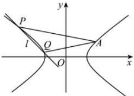

> [!faq]- 全练一本通解析
> **【答案】** （1） $\frac{x^{2}}{2}-y^{2}=1$ ；（2）证明见解析
>
> **【解析】**
> (1) 将点 A 的坐标代入双曲线 C 的方程可得 $\frac{4}{a^{2}}-\frac{1}{a^{2}-1}=1(a>1)$ ，
> 解得 $a=\sqrt{2}$ 所以，双曲线 C 的方程为 $\frac{x^{2}}{2}-y^{2}=1$ .
> （2）证明：由题意，设直线 l 的方程为 $y=-x+m$ ，设 $P(x_{1},y_{1})$ 、 $Q(x_{2},y_{2})$
> 
> 联立 $\left\{ \begin{array}{l} y = -x + m \\ \frac{x^2}{2} - y^2 = 1 \end{array} \right.$ 可得 $x^2 - 4mx + 2m^2 + 2 = 0$ ， $\Delta = 16m^2 - 8(m^2 + 1) = 8(m^2 - 1) > 0$ ，解得 $m < -1$ 或 $m > 1$ ，由韦达定理可得 $x_1 + x_2 = 4m$ ， $x_1x_2 = 2m^2 + 2$ ， $k_{AP} + k_{AQ} = \frac{y_1 - 1}{x_1 - 2} + \frac{y_2 - 1}{x_2 - 2} = \frac{-x_1 + m - 1}{x_1 - 2} + \frac{-x_2 + m - 1}{x_2 - 2} = -2 + \frac{m - 3}{x_1 - 2} + \frac{m - 3}{x_2 - 2} = -2 + \frac{(m - 3)(x_1 + x_2 - 4)}{x_1x_2 - 2(x_1 + x_2) + 4} = -2 + \frac{(m - 3)(4m - 4)}{2m^2 + 2 - 2 \times 4m + 4} = -2 + 2 = 0$ 。可得直线 $AP$ 、 $AQ$ 的斜率之和为 $0$ 。
