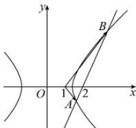

> [!faq]- 全练一本通解析
> **【答案】** （1） $\frac{x^{2}}{2}-\frac{y^{2}}{2}=1$ ；（2）存在；点 $N(1,0)$ ， $\overrightarrow{NA}\cdot\overrightarrow{NB}=-1$
>
> **【解析】**
> （1）由双曲线得渐近线方程为 $bx \pm \sqrt{2}y = 0$ ，设 $F(c,0)$ ，则 $d = \frac{|bc|}{\sqrt{2 + b^2}} = \frac{bc}{c} = b = \sqrt{2}$ ，
> ∴ 双曲线 $C$ 方程为 $\frac{x^2}{2} - \frac{y^2}{2} = 1$ ；
> （2）依题意，直线 $l$ 的斜率不为 0，设其方程为 $x = my + 2$ ， $-1 < m < 1$ ，代入 $x^2 - y^2 = 2$ 得 $(m^2 - 1)y^2 + 4my + 2 = 0$ ，设 $A(x_1, y_1), B(x_2, y_2), N(t, 0)$ ，
> 则 $y_1 + y_2 = -\frac{4m}{m^2 - 1}, y_1y_2 = \frac{2}{m^2 - 1}$ ， $\therefore \overline{NA} \cdot \overline{NB} = (x_1 - t)(x_2 - t) + y_1y_2 = (my_1 + 2 - t)(my_2 + 2 - t) + y_1y_2 = (m^2 + 1)y_1y_2 + m(2 - t)(y_1 + y_2) + (2 - t)^2 = (m^2 + 1)\frac{2}{m^2 - 1} - m(2 - t)\frac{4m}{m^2 - 1} + (2 - t)^2 = \frac{(4t - 6)m^2 + 2}{m^2 - 1} + (2 - t)^2$ 。
> 若要上式为定值，则必须有 $4t - 6 = -2$ ，即 $t = 1$ ， $\therefore \frac{(4t - 6)m^2 + 2}{m^2 - 1} + (2 - t)^2 = -2 + 1 = -1$ ，
> 故存在点 $N(1,0)$ 满足 $\overline{NA}/\overline{NB} = 1$ 。
> 故存在点 $N(1,0)$ 满足 $\overrightarrow{NA} \cdot \overrightarrow{NB} = -1$
> 
