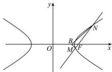

> [!faq]- 全练一本通解析
> **【解析】**
> （1） $\frac{x^{2}}{3}-y^{2}=1$ ；（2）证明见解析
> 解析：（1）因为点 $\left(\sqrt{6}, 1\right)$ 在 $C$ 上，所以 $\frac{6}{a^2} - \frac{1}{b^2} = 1$ ①,
> $$
> 2 c = 4, c = 2
> $$
> $$
> a ^ {2} + b ^ {2} = 4 \tag {②}
> $$
> 由①②解得 $a^{2}=3, b^{2}=1$ ，故双曲线 C 的方程为 $\frac{x^{2}}{3}-y^{2}=1$ 。
> （2）方法一：设直线 l 的方程为 $x = my + 2$ ，
> 
> 由 $\left\{\begin{aligned}x&=my+2\\ \frac{x^{2}}{3}-y^{2}&=1\end{aligned}\right.$ 消去 x 得， $(m^{2}-3)y^{2}+4my+1=0$ 设 $M(x_{1},y_{1}), N(x_{2},y_{2})$ ，则 $y_{1} + y_{2} = \frac{-4m}{m^{2}-3}, y_{1}y_{2} = \frac{1}{m^{2}-3}$ ，
> 因为为 $k_{BM} + k_{BN} = \frac{y_1}{x_1 - \frac{3}{2}} + \frac{y_2}{x_2 - \frac{3}{2}} = \frac{y_1}{my_1 + \frac{1}{2}} + \frac{y_2}{my_2 + \frac{1}{2}} = \frac{2y_1}{2my_1 + 1} + \frac{2y_2}{2my_2 + 1}$ $= \frac{8my_{1}y_{2} + 2(y_{1} + y_{2})}{4m^{2}y_{1}y_{2} + 2m(y_{1} + y_{2}) + 1} = \frac{\frac{8m}{m^{2}-3} - \frac{8m}{m^{2}-3}}{\frac{4m^{2}}{m^{2}-3} + \frac{-8m^{2}}{m^{2}-3} + 1} = 0$ 所以 $\tan\angle MBF + \tan(\pi - \angle NBF) = 0$ 所以 $\tan\angle MBF = \tan\angle NBF$ . 所以 $\angle MBF = \angle NBF$ .
