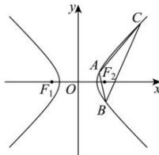

> [!faq]- 全练一本通解析
> **【解析】**
> （1） $\frac{x^{2}}{4}-\frac{y^{2}}{4}=1$ ；（2）证明见解析.
> 解析：（1）因为 E 是关于 x 轴和 y 轴均对称的等轴双曲线，故可设其方程为 $x^{2}-y^{2}=\lambda$ 又 E 经过点 $(4,2\sqrt{3})$ ，所以 $\lambda=4^{2}-(2\sqrt{3})^{2}=4$ 所以 E 的方程为 $x^{2}-y^{2}=4$ ，即 $\frac{x^{2}}{4}-\frac{y^{2}}{4}=1$ 。
> （2）因为 $A(m,n)$ 在 $E$ 上，所以 $m^2 - n^2 = 4$ 。联立方程得 $\left\{ \begin{array}{l} x^2 - y^2 = 4, \\ mx - ny = 8, \end{array} \right.$ 消去 $x$ 整理可得 $(m^2 - n^2)y^2 - 16ny + 4m^2 - 64 = 0$ ，将 $m^2 = 4 + n^2$ 代入，可得 $y^2 - 4ny + n^2 - 12 = 0$ 。所以 $\Delta = 16n^2 - 4(n^2 - 12) = 12n^2 + 48 > 0$ 。设 $B(x_1, y_1), C(x_2, y_2)$ ，则 $y_1 + y_2 = 4n, y_1y_2 = n^2 - 12$ ，所以 $|BC| = \sqrt{1 + \left(\frac{n}{m}\right)^2}|y_2 - y_1| = \sqrt{\frac{m^2 + n^2}{m^2}}\sqrt{(y_1 + y_2)^2 - 4y_1y_2} = \sqrt{\frac{m^2 + n^2}{4 + n^2}}\sqrt{16n^2 - 4(n^2 - 12)} = \sqrt{12(m^2 + n^2)}$ 。点 $A$ 到直线 $BC$ 的距离为 $d = \frac{|m^2 - n^2 - 8|}{\sqrt{m^2 + n^2}} = \frac{4}{\sqrt{m^2 + n^2}}$ ，所以 $\triangle ABC$ 的面积为 $\frac{1}{2}|BC|d = \frac{1}{2} \times \sqrt{12(m^2 + n^2)} \times \frac{4}{\sqrt{m^2 + n^2}} = 4\sqrt{3}$ ，所以 $\triangle ABC$ 的面积为定值 $4\sqrt{3}$ 。
> 
