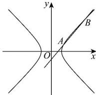

> [!faq]- 全练一本通解析
> **【解析】**
> $-\frac{2\sqrt{3}}{3}<k<-1$ 或 $1<k<\frac{2\sqrt{3}}{3}$ 解析:依题意,联立方程 $\left\{\begin{aligned}x^{2}-y^{2}=4\\ y=k(x-1)\end{aligned}\right.$ ，消去y，得 $(1-k^{2})x^{2}+2k^{2}x-k^{2}-4=0$ 设直线与双曲线的右支的两个交点为 $A(x_{1},y_{1})$ ， $B(x_{2},y_{2})(x_{1}>0,x_{2}>0)$
> 则 $\left\{\begin{aligned}1-k^{2}\neq0\\ \Delta=4k^{2}-4(1-k^{2})(-k^{2}-4)=4(4-3k^{2})>0\\ x_{1}+x_{2}&=-\frac{2k^{2}}{1-k^{2}}>0\\ x_{1}x_{2}&=-\frac{k^{2}+4}{1-k^{2}}>0\end{aligned}\right.$ 解得 $-\frac{2\sqrt{3}}{3}<k<-1$ 或 $1<k<\frac{2\sqrt{3}}{3}$ ,
> 所以 $-\frac{2\sqrt{3}}{3}<k<-1$ 或 $1<k<\frac{2\sqrt{3}}{3}$ .
> 
