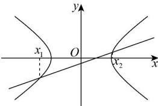

> [!faq]- 全练一本通解析
> **【答案】** -1<k<1
>
> **【解析】**
> 联立双曲线、直线方程,消去 y 整理得 $\left(1-k^{2}\right)x^{2}+2k^{2}x-k^{2}-4=0$ , 由题意,设方程的两根为 $x_{1}, x_{2}$ ,
> 则 $\left\{ \begin{array}{l} 1 - k^2 \neq 0 \\ \Delta = 4(4 - 3k)^2 > 0 \\ x_1x_2 = -\frac{k^2 + 4}{1 - k^2} < 0 \end{array} \right.$ ，解得 $-1 < k < 1$ 。故答案为： $-1 < k < 1$
> 
