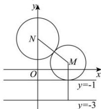

> [!faq]- 全练一本通解析
> **【答案】** $x^{2}=12y$
>
> **【解析】**
> 由题意得, 直线 l: y = -1 , 且圆 $N: x^{2} + (y - 3)^{2} = 4$ ,
> 设圆 M 半径为 r，则点 M 到 $l' : y = -3$ 与点 M 到点 N 的距离相等，都是 $r + 2$ ，故点 M 的轨迹是以 N 为焦点，以 $l'$ 为准线的抛物线，故方程为 $x^{2} = 12y$ ．故答案为： $x^{2} = 12y$
> 
