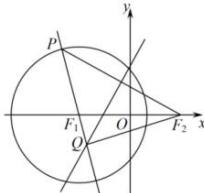

> [!faq]- 全练一本通解析
> **【答案】** C
>
> **【解析】**
> 解析:如图所示:
> 
> ∵ P 是圆 $F_{1}$ 上一动点，点 $F_{2}$ 的坐标为 $(3,0)$ ，线段 $PF_{2}$ 的垂直平分线交直线 $PF_{1}$ 于点 Q，
> ∴ $\left|QP\right|=\left|QF_{2}\right|,\left\|QF_{1}\right|-\left|QF_{2}\right\|=\left\|QF_{1}\right|-\left|QP\right\|=\left|PF_{1}\right|$ ∵ P 是圆 $F_{1}$ 上一动点，∴ $\left|PF_{1}\right|=4$ ，∴ $\left\|QF_{1}\right|-\left|QF_{2}\right|=4$ ∴ $F_{2}(3,0)$ ， $F_{1}(-3,0)$ ， $\left|F_{1}F_{2}\right|=6>4$ ∴ 点 Q 的轨迹为以 F1、F2 为焦点的双曲线，且 a=2, c=3，得 $b=\sqrt{5}$ ，
> ∴ 点 Q 的轨迹方程为 $\frac{x^{2}}{4}-\frac{y^{2}}{5}=1$ 。
>
> 故选 **C**.
