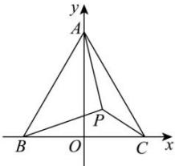

> [!faq]- 全练一本通解析
> **【答案】** $x^{2}+\left(y+\sqrt{3}a\right)^{2}=4a^{2},0<y\leq\left(2-\sqrt{3}\right)a$
>
> **【解析】**
> 如图，以 BC 所在直线为 x 轴，以 BC 的中垂线为 y 轴，建立平面直角坐标系，
> 则 $B(-a,0)$ ， $C(a,0)$ ， $A(0,\sqrt{3}a)$ ，设 $P(x,y)$ ，
> 因为 $\left|PB\right|^{2}=\left(x+a\right)^{2}+y^{2},\left|PC\right|^{2}=\left(x-a\right)^{2}+y^{2},\left|PA\right|^{2}=x^{2}+\left(y-\sqrt{3}a\right)^{2}$ ，
> 而 $\left|PA\right|^{2}=\left|PB\right|^{2}+\left|PC\right|^{2}$ 则 $x^{2}+\left(y-\sqrt{3}a\right)^{2}=\left(x+a\right)^{2}+y^{2}+\left(x-a\right)^{2}+y^{2}$ 化简得 $x^{2}+\left(y+\sqrt{3}a\right)^{2}=4a^{2}$ 由题意知 $0<y\leq\left(2-\sqrt{3}\right)a$ 所以点 P 的轨迹方程为 $x^{2}+\left(y+\sqrt{3}a\right)^{2}=4a^{2},0<y\leq\left(2-\sqrt{3}\right)a$
> 
