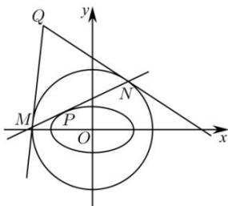

<!-- question-source:start -->
【32】如图, P 为椭圆 $C_{1}:\frac{x^{2}}{8}+\frac{y^{2}}{6}=1$ 上的动点, 过 P 作椭圆 $C_{1}$ 的切线交圆 $C_{2}:x^{2}+y^{2}=24$ 于 M、N, 过 M、N 作 $C_{2}$ 切线交于 Q, 求 Q 的轨迹方程.

第十一节 专题：求圆锥曲线的轨迹方程

<table><tr><td>题型4:点差法求轨迹方程
<!-- question-source:end -->

![[Q00008506A1]]
