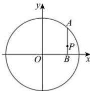

> [!faq]- 全练一本通解析
> **【解析】**
> $\frac{x^{2}}{9}+y^{2}=1$ 解析: 设 $P(x,y)$ ， $A(m,n)$ ，则 $B(x,0)$ ，
> 因为 $\left|PB\right|=\frac{1}{3}\left|AB\right|$ ，则 $\overline{BP}=\frac{1}{3}\overline{BA}$ 则 $(0,y)=\frac{1}{3}(m-x,n)$ ，可得 $\left\{\begin{aligned}0&=\frac{1}{3}(m-x)\\ y&=\frac{1}{3}n\end{aligned}\right.$ ，解得 $\left\{\begin{aligned}m=x\\ n=3y\end{aligned}\right.$ ，即 $A(x,3y)$ .
> 因为点 A 在圆 $x^{2}+y^{2}=9$ 上，则 $x^{2}+9y^{2}=9$ ，即 $\frac{x^{2}}{9}+y^{2}=1$ ，
> 
