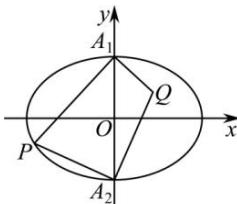

> [!faq]- 全练一本通解析
> **【解析】**
> （1）证明见解析， $-\frac{1}{2}$ （2） $\frac{y^{2}}{2}+x^{2}=1(x\neq0)$ 解析：（1）由题意可知 $A_{1}(0,\sqrt{2}),A_{2}(0,-\sqrt{2})$ 设点 $P(x_{0},y_{0})$ ，显然 $x_{0}\neq0,\because\frac{x_{0}^{2}}{4}+\frac{y_{0}^{2}}{2}=1.\therefore\frac{x_{0}^{2}}{4}=1-\frac{y_{0}^{2}}{2}=\frac{2-y_{0}^{2}}{2},\therefore\frac{2-y_{0}^{2}}{x_{0}^{2}}=\frac{1}{2}$ $\therefore k_{1}k_{2}=\frac{y_{0}-\sqrt{2}}{x_{0}}\times\frac{y_{0}+\sqrt{2}}{x_{0}}=\frac{y_{0}^{2}-2}{x_{0}^{2}}=-\frac{1}{2}$ ，为定值.
> 
> （2）设点 $Q(x,y),x\neq 0$ ， $\because QA_{1}\bot PA_{1}$ ，由于 $y_0\neq \pm \sqrt{2}$ ， $\therefore k_{QA_1} = -\frac{x_0}{y_0 - \sqrt{2}}$ $\therefore QA_{1}$ 的方程： $y = -\frac{x_0}{y_0 - \sqrt{2}} x + \sqrt{2}$ ①. $\because QA_{2}\bot PA_{2},\therefore k_{QA_{2}} = -\frac{x_{0}}{y_{0} + \sqrt{2}},$ $\therefore QA_{1}$ 的方程： $y = -\frac{x_0}{y_0 + \sqrt{2}} x - \sqrt{2}$ ②
> 由①②联立可得： $x = \frac{y_0^2 - 2}{x_0} = -\frac{x_0}{2},$ 代入①可得 $y = -\frac{x_0}{y_0 - \sqrt{2}}\times \frac{y_0^2 - 2}{x_0} +\sqrt{2} = -(y_0 + \sqrt{2}) + \sqrt{2} = -y_0,$ 即点 $Q\left(-\frac{x_0}{2}, - y_0\right)$ $\therefore \left\{ \begin{array}{ll}x_0 = -2x\\ y_0 = -y \end{array} \right.,\because$ 点 $P(x_0,y_0)$ 满足： $\frac{x_0^2}{4} +\frac{y_0^2}{2} = 1$ ∴代入可得 $\frac{y^2}{2} +x^2 = 1,\therefore$ 点 $Q$ 的轨迹方程为： $\frac{y^2}{2} +x^2 = 1(x\neq 0)$
