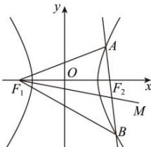

> [!faq]- 全练一本通解析
> **【解析】**
> $(x - 6)^{2} - y^{2} = 4$ 解析： $x^{2} - y^{2} = 2$ ，即 $\frac{x^{2}}{2} - \frac{y^{2}}{2} = 1$ ，故 $F_{1}(-2,0), F_{2}(2,0)$ ，设 $M(x,y), A(x_{1},y_{1}), B(x_{2},y_{2})$ 。
> 
> 则 $\overrightarrow{F_{1}M}=(x+2,y)$ ， $\overrightarrow{F_{1}A}=(x_{1}+2,y_{1})$ ， $\overrightarrow{F_{1}B}=(x_{2}+2,y_{2})$ ， $\overrightarrow{F_{1}O}=(2,0)$ ，
> 由 $\overrightarrow{F_{1}M}=\overrightarrow{F_{1}A}+\overrightarrow{F_{1}B}+\overrightarrow{F_{1}O}$ 得 $\left\{\begin{aligned}&x+2=x_{1}+x_{2}+6\\&y=y_{1}+y_{2}\end{aligned}\right.$ 即 $\left\{\begin{aligned}&x_{1}+x_{2}=x-4\\&y_{1}+y_{2}=y\end{aligned}\right.$ 于是 AB 的中点坐标为 $\left(\frac{x-4}{2},\frac{y}{2}\right)$ .
> 当 AB 不与 x 轴垂直时， $\frac{y_{1}-y_{2}}{x_{1}-x_{2}}=\frac{\frac{y}{2}}{\frac{x-4}{2}-2}=\frac{y}{x-8}$ ，即 $y_{1}-y_{2}=\frac{y}{x-8}(x_{1}-x_{2}).$ 又因为 A, B 两点在双曲线上，所以 $x_{1}^{2}-y_{1}^{2}=2$ ， $x_{2}^{2}-y_{2}^{2}=2$ ，
> 两式相减得 $(x_{1}-x_{2})(x_{1}+x_{2})=(y_{1}-y_{2})(y_{1}+y_{2})$ ，即 $(x_{1}-x_{2})(x-4)=(y_{1}-y_{2})y.$ 将 $y_{1}-y_{2}=\frac{y}{x-8}(x_{1}-x_{2})$ 代入上式，化简得 $(x-6)^{2}-y^{2}=4$ 。
> 当 AB 与 x 轴垂直时， $x_{1}=x_{2}=2$ ，求得 M(8,0)，也满足上述方程。
> 综上所述：点 M 的轨迹方程是 $(x-6)^{2}-y^{2}=4$ 。
