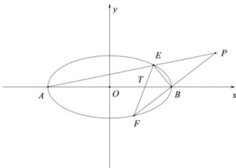

> [!faq]- 全练一本通解析
> **【答案】** x=4
>
> **【解析】**
> 根据题意可得 $A(-2,0),F(2,0)$ ，设直线
> l: x=my+1, $E(x_{1},y_{1}), F(x_{2},y_{2})$ ,
> 联立方程 $\left\{\begin{aligned}x&=my+1\\ \frac{x^{2}}{4}&+y^{2}=1\end{aligned}\right.$ ，消去 x 得 $(m^{2}+4)y^{2}+2my-3=0$ ∴ $y_{1}+y_{2}=-\frac{2m}{m^{2}+4}, y_{1}y_{2}=-\frac{3}{m^{2}+4}$ 根据题意可得直线 AE: $y=\frac{y_{1}}{x_{1}+2}(x+2)$ , BF: $y=\frac{y_{2}}{x_{2}-2}(x-2)$
> 联立方程 $\left\{ \begin{array}{l} y = \frac{y_1}{x_1 + 2}(x + 2) \\ y = \frac{y_2}{x_2 - 2}(x - 2) \end{array} \right.$ ，解得 $x = \frac{-4my_1y_2 + 2y_1 - 6y_2}{-y_1 - 3y_2} = \frac{-4my_1y_2 + 2(y_1 + y_2) - 8y_2}{-(y_1 + y_2) - 2y_2}$ $\because y_1 + y_2 = -\frac{2m}{m^2 + 4}, y_1y_2 = -\frac{3}{m^2 + 4}$ $\therefore x = \frac{\frac{8m}{m^2 + 4} - 8y_2}{\frac{2m}{m^2 + 4} - 2y_2} = 4$
> $$
> \therefore P
> $$
> $$
> x = 4
> $$
> 
