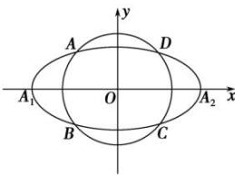

<!-- question-source:start -->
【52】如图,椭圆 $C_{0}:\frac{x^{2}}{a^{2}}+\frac{y^{2}}{b^{2}}=1\quad(a>b>0)$ ，动圆 $C_{1}:x^{2}+y^{2}=t_{1}^{2},\quad b<t_{1}<a$ ，点 $A_{1},A_{2}$ 分别为 $C_{0}$ 的左，右顶点， $C_{1}$ 与 $C_{0}$ 相交于A,B,C,D四点，求直线 $AA_{1}$ 与直线 $A_{2}B$ 交点M的轨迹方程.

<!-- question-source:end -->
