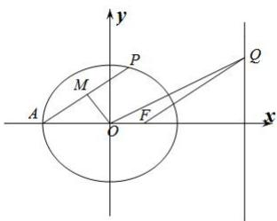

<!-- question-source:start -->
【55】过椭圆 $C: \frac{x^2}{4} + \frac{y^2}{3} = 1$ 的左顶点 $A$ 作直线与椭圆相交, 另一交点为 $P$ , 点 $M$ 是 $AP$ 的中点, 点 $Q$ 在直线 $x = 4$ 上, 且 $OQ // AP$ , 求直线 $OM$ 与直线 $QF$ 的交点的轨迹方程.

第十一节 专题：求圆锥曲线的轨迹方程
<!-- question-source:end -->
