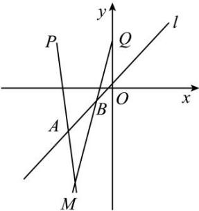

<!-- question-source:start -->
【59】（2021·全国高三专题练习）已知点 $P(-2,2)$ 、 $Q(0,2)$ 以及直线l:y=x，设长为 $\sqrt{2}$ 的线段AB在直线l上移动（如图所示），求直线PA和QB的交点M的轨迹方程.

第十一节 专题：求圆锥曲线的轨迹方程
<!-- question-source:end -->

![[Q00008533A1]]
