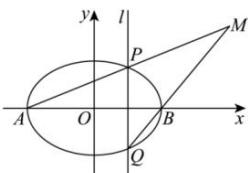

> [!faq]- 全练一本通解析
> **【解析】**
> $\frac{x^{2}}{4}-\frac{y^{2}}{2}=1(x\neq\pm2)$ 解析:由椭圆 $\frac{x^{2}}{4}+\frac{y^{2}}{2}=1$ 方程可知：a=2，则A(-2,0)，B(2,0)，设 $P(x_{0},y_{0}),x_{0}\in(-2,2)$ ，则 $Q(x_{0},-y_{0})$ ，则 $\frac{x_{0}^{2}}{4}+\frac{y_{0}^{2}}{2}=1$ ，
> 直线 AP 的方程为： $y=\frac{y_{0}}{x_{0}+2}(x+2)$ ，直线 BQ 的方程
> 为： $y=\frac{-y_{0}}{x_{0}-2}(x-2)$ ，
> 两式相乘可得 $y^{2}=\frac{-y_{0}^{2}}{x_{0}^{2}-4}(x^{2}-4)$ 又因为 $y_{0}^{2}=2(1-\frac{x_{0}^{2}}{4})=\frac{4-x_{0}^{2}}{2}$ ，所以 $y^{2}=\frac{x^{2}-4}{2}$ ，即 $\frac{x^{2}}{4}-\frac{y^{2}}{2}=1$ ，
> 所以直线 AP 与直线 BQ 的交点 M 的轨迹方程是 $\frac{x^{2}}{4}-\frac{y^{2}}{2}=1(x\neq\pm2)$
> 
