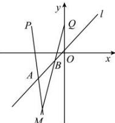

> [!faq]- 全练一本通解析
> **【解析】**
> $x^{2} - y^{2} + 2x - 2y + 8 = 0.$ 解析：如图所示，∵点 $A,B$ 在直线 $y = x$ 上，设点 $A,B,M$ 的坐标分别为 $(a,a),(b,b),(x,y)$ ，其中 $b > a$ 当 $y\neq 2$ 时，由 $P(-2,2)$ 、 $A(a,a)$ 、 $M(x,y)$ 三点共线，得 $\frac{x + 2}{y - 2} = \frac{a + 2}{a - 1}$ ，解出 $a,$ 得 $a = \frac{2(x + y)}{x - y + 4}$ ①，由 $Q(0,2)$ 、 $B(b,b)$ 、 $M(x,y)$ 三点共线，得 $\frac{x}{y - 2} = \frac{b}{b - 2}$ ，解出 $b,$ 得 $b = \frac{2x}{x - y + 2}$ .②由条件 $\left|AB\right| = \sqrt{2}$ ，得 $\sqrt{2}(b - a) = \sqrt{2}.\therefore b = a + 1.$ ③，由①、②、③式得 $\frac{2x}{x - y + 2} = \frac{2(x + y)}{x - y + 4} +1.$ 整理得 $x^{2} - y^{2} + 2x - 2y + 8 = 0.$ 当 $y = 2$ 时，两直线 $PA$ 和 $QB$ 的交点 $M$ 与点 $P(-2,2)$ 或点 $Q(0,2)$ 重合，得点 $P$ 和点 $Q$ 的坐标都满足方程 $x^{2} - y^{2} + 2x - 2y + 8 = 0.$ 故 $x^{2} - y^{2} + 2x - 2y + 8 = 0$ 就是点 $M$ 的轨迹方程.
> 
