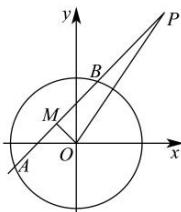

> [!faq]- 全练一本通解析
> **【解析】**
> $x^{2}+y^{2}-5x-12y=0$ ，其中-3<x<3。
> 解析：[方法一]：直接法设弦 $AB$ 的中点 $M$ 的坐标为 $M(x,y)$ ，连接 $OP$ 、 $OM$ ，则 $OM \perp AB$ 。在 $\triangle OMP$ 中，由勾股定理有 $x^{2} + y^{2} + (x - 5)^{2} + (y - 12)^{2} = 169$ ，而 $M(x,y)$ 在圆内，所以弦 $AB$ 的中点 $M$ 的轨迹方程为 $x^{2} + y^{2} - 5x - 12y = 0 (-3 < x < 3)$ 。
> 
> [方法 2]: 定义法
> 因为 M 是 AB 的中点, 所以 $OM \perp AB$ , 所以点 M 的轨迹是以 OP 为直径的圆, 圆心为 $\left(\frac{5}{2}, 6\right)$ , 半径为 $\frac{|OP|}{2} = \frac{13}{2}$ , 所以该圆的方程
> 为: $\left(x - \frac{5}{2}\right)^{2} + (y - 6)^{2} = \left(\frac{13}{2}\right)^{2}$ , 化简得 $x^{2} + y^{2} - 5x - 12y = 0 (-3 < x < 3)$ [方法 3]: 交轨法
> 易知过 P 点的割线的斜率必然存在, 设过 P 点的割线的斜率为 k,
> 则过 P 点的割线方程为: $y - 12 = k(x - 5)$ .
> ∵ $OM \perp AB$ 且过原点, ∴ OM 的方程为 $y = -\frac{1}{k}x$
> 这两条直线的交点就是 M 点的轨迹. 两方程相乘消去 k, 化简, 得: $x^{2} + y^{2} - 5x - 12y = 0$ ,
> [方法4]：参数法
> 设过 $P$ 点的割线方程为： $y - 12 = k(x - 5)$ ，它与圆 $x^{2} + y^{2} = 9$ 的两个交点为 $A$ 、 $B$ $AB$ 的中点为 $M$ ，设 $M(x,y),A(x_1,y_1),B(x_2,y_2)$ .
> 由 $\left\{ \begin{array}{l}y = k(x - 5) + 12\\ x^2 +y^2 = 9 \end{array} \right.$ 可得， $(1 + k^2)x^2 +2k(12 - 5k)x + (12 - 5k)^2 -9 = 0$ ，所以， $x_{1} + x_{2} = -\frac{2k(12 - 5k)}{1 + k^{2}}$ ，即有 $x = -\frac{k(12 - 5k)}{1 + k^2}$ ， $y = \frac{12 - 5k}{1 + k^2}$ ，消去 $k$ ，可求得 $M$ 点的轨迹方程为： $x^{2} + y^{2} - 5x - 12y = 0$ ， $-3 <   x <   3$ ：
> [方法5]：点差法
> 设 $M(x,y), A(x_{1},y_{1}), B(x_{2},y_{2})$ ，则 $x_{1} + x_{2} = 2x, y_{1} + y_{2} = 2y$ .
> ∵ $x_{1}^{2} + y_{1}^{2} = 9, x_{2}^{2} + y_{2}^{2} = 9$ . 两式相减，整理，得 $(x_{2}-x_{1})(x_{2}+x_{1})-(y_{2}-y_{1})(y_{1}+y_{2})=0$ 所以 $\frac{y_{2}-y_{1}}{x_{2}-x_{1}}=-\frac{x_{1}+x_{2}}{y_{1}+y_{2}}=-\frac{x}{y}$ ，即为 AB 的斜率，
> 而 AB 的斜率又可表示为 $\frac{12-y}{5-x}, \therefore \frac{12-y}{5-x}=-\frac{x}{y}$ ，化简并整理，得 $x^{2}+y^{2}-5x-12y=0$ 其中 -3 < x < 3.
