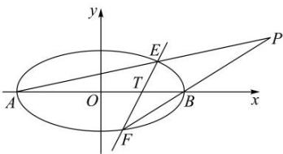

<!-- question-source:start -->
【48】(2022·陕西西安模拟)已知椭圆 $C: \frac{x^{2}}{4} + y^{2} = 1$ ，经过定点 $T(1,0)$ 斜率不为 0 的直线 l 交 C 于 E, F 两点，A, B 分别为椭圆 C 的左，右两顶点。求直线 AE 与 BF 的交点 P 的轨迹方程。

<!-- question-source:end -->

![[Q00008522A1]]
