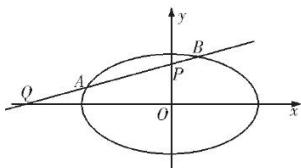
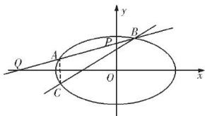

> [!faq]- 全练一本通解析
> **【答案】** （1） $y=\frac{\sqrt{2}}{8}x+\frac{\sqrt{2}}{2}$ 或 $y=-\frac{\sqrt{2}}{8}x-\frac{\sqrt{2}}{2}$ ; （2）见解析
>
> **【解析】**
> （1）由条件可知直线 l 的斜率存在，则可设直线 l 的方程为 $y=k(x-4)$ ，则 $P(0,4k)$ ，
> 由 $\overline{PA}=\frac{3}{2}\overline{AQ}$ ，有 $(x_{A},y_{A}-4k)=\frac{3}{2}(-4-x_{A},-y_{A})$ ，
> 所以 $x_{A}=-\frac{12}{5},y_{A}=\frac{8k}{5}$ ，
> 由 $A\left(-\frac{12}{5},\frac{8k}{5}\right)$ 在椭圆 E 上，则 $\frac{\left(-\frac{12}{5}\right)^{2}}{6}+\frac{\left(\frac{8k}{5}\right)^{2}}{2}=1$ ，解得 $k=\pm\frac{\sqrt{2}}{8}$ ，此
> 时 $P\left(0,\pm\frac{\sqrt{2}}{2}\right)$ 在椭圆 E 内部，所以满足直线 l 与椭圆相交，
> 故所求直线 l 方程为 $y=\frac{\sqrt{2}}{8}x+\frac{\sqrt{2}}{2}$ 或 $y=-\frac{\sqrt{2}}{8}x-\frac{\sqrt{2}}{2}$ .
> （也可联立直线 l 与椭圆方程中 $\Delta>0$ 验证）
> $$
> \Delta > 0
> $$
> 
> （2）设 $A(x_{1},y_{1}), B(x_{2},y_{2})$ ，则 $C(x_{1},-y_{1})$ ，
> 直线 BC 的方程为 $(y_{1}+y_{2})x+(x_{1}-x_{2})y-(x_{2}y_{1}+x_{1}y_{2})=0$ 由 $\left\{\begin{aligned}y=k(x+4),\\ x^{2}+3y^{2}=6\end{aligned}\right.$ 得 $(1+3k^{2})x^{2}+24k^{2}x+48k^{2}-6=0$ 由 $\Delta=(24k^{2})^{2}-4(1+3k^{2})(48k^{2}-6)>0$ 解得 $k^{2}<\frac{1}{5}$ , $x_{1}+x_{2}=-\frac{24k^{2}}{1+3k^{2}},x_{1}x_{2}=\frac{48k^{2}-6}{1+3k^{2}}$ 当 y=0 时， $x=\frac{x_{2}y_{1}+x_{1}y_{2}}{y_{1}+y_{2}}=\frac{x_{2}k(x_{1}+4)+x_{1}k(x_{2}+4)}{k(x_{1}+x_{2}+8)}=\frac{2kx_{1}x_{2}+4k(x_{1}+x_{2})}{k(x_{1}+x_{2}+8)}=\frac{2k\cdot\frac{48k^{2}-6}{1+3k^{2}}+4k\cdot\frac{-24k^{2}}{1+3k^{2}}}{k\left(\frac{-24k^{2}}{1+3k^{2}}+8\right)}=\frac{2(48k^{2}-6)-96k^{2}}{8}=-\frac{3}{2}$ 故直线 BC 恒过定点 $\left(-\frac{3}{2},0\right)$ .
> 
