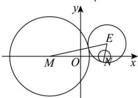

> [!faq]- 全练一本通解析
> **【解析】**
> （1） $\frac{x^{2}}{4}-y^{2}=1,(x\geq2)$ ;（2）直线 l 恒过点 $\left(\frac{10}{3},0\right)$ ，理由见解答.
> 解析：（1）如图，设圆 E 的圆心为 $E(x,y)$ ，半径为 r，
> 由题可得圆 M 半径为 3，圆 N 半径为 1，则 $|EM|=r+3,|EN|=r-1$ 所以 $|EM|-|EN|=4<|MN|=2\sqrt{5}$ 由双曲线定义可知，E 的轨迹是以 M，N 为焦点、实轴长为 4 的双曲线的右支，
> 又 $M(-\sqrt{5},0),N(\sqrt{5},0)$ 所以动圆的圆心 E 的轨迹方程为 $\frac{x^{2}}{4}-y^{2}=1,(x\geq2)$ 即曲线 C 的方程为 $\frac{x^{2}}{4}-y^{2}=1,(x\geq2)$ .
> 
> （2）设直线 l 的方程为 $x=my+t$ ,
> 联立 $\left\{\begin{aligned}x=my+t\\ \frac{x^{2}}{4}-y^{2}=1,(x\geq2)\end{aligned}\right.$ ，消去x得 $(m^{2}-4)y^{2}+2mty+t^{2}-4=0$ ，
> 由题意直线与曲线有两个交点，则 $m^{2}-4\neq0$ ，
> 设 $A(x_{1},y_{1})$ ， $B(x_{2},y_{2})$ ，其中 $x_{1}\geq2$ ， $x_{2}\geq2$ ，
> 由韦达定理得： $y_{1} + y_{2} = \frac{-2mt}{m^{2}-4}$ ， $y_{1}y_{2} = \frac{t^{2}-4}{m^{2}-4}$
> 又点 $P(2,0)$ ，所以 $\overline{PA} = (x_1 - 2, y_1), \overline{PB} = (x_2 - 2, y_2)$ ，因为 $\overline{PA} \cdot \overline{PB} = 0$ ，所以 $(x_1 - 2)(x_2 - 2) + y_1y_2 = 0$ ，则 $(my_1 + t - 2)(my_2 + t - 2) + y_1y_2 = (m^2 + 1)y_1y_2 + (mt - 2m)(y_1 + y_2) + (t - 2)^2 = \frac{(m^2 + 1)(t^2 - 4) - 2mt(mt - 2m) + (t - 2)^2(m^2 - 4)}{m^2 - 4} = 0$ ，即 $3t^2 - 16t + 20 = 0$ ，解得 $t = \frac{10}{3}(t = 2$ 舍去），当 $t = \frac{10}{3}$ ，直线 $l$ 的方程为 $x = my + \frac{10}{3}, m \neq \pm \frac{1}{2}$ ，故直线 $l$ 恒过点 $\left(\frac{10}{3}, 0\right)$ .
