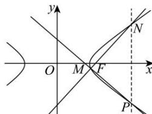

> [!faq]- 全练一本通解析
> **【答案】** （1） $\frac{3\sqrt{2}}{4}$ （2）证明见解析
>
> **【解析】**
> （1）由双曲线 $\Omega: mx^2 - ny^2 = 1$ 经过点 $A(8,\sqrt{7}), B(4,-1)$ ，则有 $\left\{\begin{array}{l}64m - 7n = 1 \\16m - n = 1\end{array}\right.$ ，解得 $\left\{\begin{array}{l}m = \frac{1}{8}\\n = 1\end{array}\right.$ ，即双曲线的标准方程为 $\frac{x^2}{8} - y^2 = 1$ ，则 $a = 2\sqrt{2}, b = 1, c = 3$ ，所以离心率 $e = \frac{c}{a} = \frac{3}{2\sqrt{2}} = \frac{3\sqrt{2}}{4}$ ，故 $\Omega$ 的离心率为 $\frac{3\sqrt{2}}{4}$ ；（2）由（1）知 $\Omega$ 的右焦点为 (3,0)，直线 $l: y = k(x - 3)$ ，设 $M(x_1, y_1), N(x_2, y_2)$ ，由点 $N$ 关于 $x$ 轴的对称点为点 $P$ ，则 $P(x_2, -y_2)$ ，联立 $\left\{\begin{array}{l}y = k(x - 3)\\ \frac{x^2}{8} - y^2 = 1\end{array}\right.$ ，得 $\left(1 - 8k^2\right)x^2 + 48k^2x - 72k^2 - 8 = 0$ ，由题可知 $1 - 8k^2 \neq 0$ ，即 $k^2 \neq \frac{1}{8}$ ，且 $\Delta = 48^2k^4 + 4(1 - 8k^2)(72k^2 + 8) = 32(1 + k^2) > 0$ ，则 $\left\{\begin{array}{l}x_1 + x_2 = \frac{48k^2}{8k^2 - 1}\\ x_1x_2 = \frac{72k^2 + 8}{8k^2 - 1}\end{array}\right.$ ，则直线 $PM$ 的直线方程为 $y - y_1 = \frac{y_1 + y_2}{x_1 - x_2}(x - x_1)$ ，由对称性可知，直线 $PM$ 若过定点，则必在 $x$ 轴上，令 $y = 0$ ，得 $x = -y_1\frac{x_1 - x_2}{y_1 + y_2} + x_1 = \frac{y_1x_2 + x_1y_2}{y_1 + y_2}$ $= \frac{k(x_1 - 3)x_2 + kx_1(x_2 - 3)}{k(x_1 - 3) + k(x_2 - 3)} = \frac{2kx_1x_2 - 3k(x_1 + x_2)}{k(x_1 + x_2) - 6k}$ 当 $k \neq 0$ ，且 $k^2 \neq \frac{1}{8}$ 时， $x = \frac{2\cdot\frac{72k^2 + 8}{8k^2 - 1} - 3\cdot\frac{48k^2}{8k^2 - 1}}{\frac{48k^2}{8k^2 - 1} - 6} = \frac{144k^2 + 16 - 144k^2}{48k^2 - (48k^2 - 6)} = \frac{8}{3}$ ，所以直线 $PM$ 过定点 $\left(\frac{8}{3}, 0\right)$ .
> 
