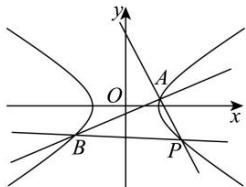

> [!faq]- 全练一本通解析
> **【解析】**
> （1） $\frac{x^{2}}{3}-\frac{y^{2}}{2}=1$ （2）证明见解析
> 解析：（1）因为虚轴长为 $2b = 2\sqrt{2}$ ，所以 $b = \sqrt{2}$ 将 $P(3, - 2)$ 的坐标代入方程 $\frac{x^2}{a^2} -\frac{y^2}{b^2} = 1$ ，得 $\frac{9}{a^2} -\frac{4}{2} = 1$ ，解得 $a^2 = 3$ 故 $C$ 的方程为 $\frac{x^2}{3} -\frac{y^2}{2} = 1$ （2）设 $A(x_{1},y_{1}),B(x_{2},y_{2})$ ，直线 $AP$ 的斜率为 $k_{1}$ ，直线 $BP$ 的斜率为 $k_{2}$ 当直线 l 的斜率不存在时，设 l: x = t，联立 $\left\{\frac{x^{2}}{3} - \frac{y^{2}}{2} = 1\right.$ 得 $y=\pm\sqrt{\frac{2t^{2}}{3}-2}$ ，即 $A\left(t,\sqrt{\frac{2t^{2}}{3}-2}\right),B\left(t,-\sqrt{\frac{2t^{2}}{3}-2}\right)$ ，
> 由 $k_{1}k_{2}=\frac{1}{3}$ ，得 $\frac{\sqrt{\frac{2t^{2}}{3}-2}+2}{t-3}\times\frac{-\sqrt{\frac{2t^{2}}{3}-2}+2}{t-3}=\frac{1}{3}$ ，解得 t=-1（舍去）或 t=3（舍去），
> 所以直线 l 的斜率存在，设直线 l 的方程为 $y=kx+m$ ，
> 代入 C 的方程得 $(2-3k^{2})x^{2}-6kmx-3m^{2}-6=0$ ，
> 则 $x_{1}+x_{2}=\frac{6km}{2-3k^{2}},x_{1}x_{2}=\frac{-3m^{2}-6}{2-3k^{2}}$ 由 $k_{1}k_{2}=\frac{(y_{1}+2)(y_{2}+2)}{(x_{1}-3)(x_{2}-3)}=\frac{(kx_{1}+m+2)(kx_{2}+m+2)}{x_{1}x_{2}-3(x_{1}+x_{2})+9}=\frac{k^{2}x_{1}x_{2}+k(m+2)(x_{1}+x_{2})+(m+2)^{2}}{x_{1}x_{2}-3(x_{1}+x_{2})+9}=\frac{1}{3}$ 可得 $\left(k^{2}-\frac{1}{3}\right)x_{1}x_{2}+(km+2k+1)\left(x_{1}+x_{2}\right)+m^{2}+4m+1=0$ 即 $\left(k^{2}-\frac{1}{3}\right)\cdot\frac{-3m^{2}-6}{2-3k^{2}}+(km+2k+1)\cdot\frac{6km}{2-3k^{2}}+m^{2}+4m+1=0$ 化简得 $3m^{2}+(6k+8)m-(9k^{2}-4)=0$ ，即 $(3m-3k+2)(m+3k+2)=0$ ，
> 所以 m=k- $\frac{2}{3}$ 或 m=-3k-2，
> 当 m=-3k-2 时，直线 l 的方程为 y=kx-3k-2，直线 l 过点 P(3,-2)，与条件矛盾，舍去；
> 当 $m=k-\frac{2}{3}$ 时，直线 l 的方程为 $y=kx+k-\frac{2}{3}$ ，直线 l 过定点 $\left(-1,-\frac{2}{3}\right)$ .
> 
