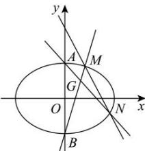

> [!faq]- 全练一本通解析
> **【解析】**
> （1）证明见解析（2）证明见解析
> 解析：（1）设 $M(x_{1},y_{1}),N(x_{2},y_{2})$ ，则 $P\left(\frac{x_{1}+x_{2}}{2},\frac{y_{1}+y_{2}}{2}\right)$ .
> 由 $\left\{\begin{aligned}&b^{2}x_{1}^{2}+a^{2}y_{1}^{2}=a^{2}b^{2},\\&b^{2}x_{2}^{2}+a^{2}y_{2}^{2}=a^{2}b^{2},\end{aligned}\right.$ 两式相减得 $b^{2}\left(x_{1}^{2}-x_{2}^{2}\right)+a^{2}\left(y_{1}^{2}-y_{2}^{2}\right)=0$ ，即 $\frac{y_{1}^{2}-y_{2}^{2}}{x_{1}^{2}-x_{2}^{2}}=-\frac{b^{2}}{a^{2}}.$ 所以 $k_{OP}\cdot k_{MN}=\frac{y_{1}+y_{2}}{x_{1}+x_{2}}\cdot\frac{y_{1}-y_{2}}{x_{1}-x_{2}}=\frac{y_{1}^{2}-y_{2}^{2}}{x_{1}^{2}-x_{2}^{2}}=-\frac{b^{2}}{a^{2}}=e^{2}-1=\frac{1}{2}-1=-\frac{1}{2}.$ （2）由 $\left\{\begin{aligned}&2b=4,\\&\frac{c}{a}=\frac{\sqrt{2}}{2},\\&a^{2}=b^{2}+c^{2},\end{aligned}\right.$ 解得 $\left\{\begin{aligned}&a=2\sqrt{2},\\&b=2,\\&c=2.\end{aligned}\right.$ 所以椭圆C的方程为 $\frac{x^{2}}{8}+\frac{y^{2}}{4}=1$ .
> 将直线的方程 $y=kx+4$ 代入椭圆 C 的方程 $x^{2}+2y^{2}=8$ ，化简整理得 $(2k^{2}+1)x^{2}+16kx+24=0$ 。
> - **①**：
> 由 $\Delta = 32(2k^2 - 3) > 0$ ，解得 $k^2 > \frac{3}{2}$ .
> 由韦达定理，得 $x_1 + x_2 = \frac{-16k}{2k^2 + 1}$ ， $x_1x_2 = \frac{24}{2k^2 + 1}$ . ②
> 设 $M(x_1, kx_1 + 4)$ ， $N(x_2, kx_2 + 4)$ ，
> 则直线 $MB$ 的方程为 $y = \frac{kx_1 + 6}{x_1} x - 2$ ，③
> 直线 $NA$ 的方程为 $y = \frac{kx_2 + 2}{x_2} x + 2$ ，④
> 由③④两式解得 $y = \frac{2(kx_1x_2 + x_1 + 3x_2)}{3x_2 - x_1} = \frac{2\left(\frac{24k}{2k^2 + 1} + \frac{-16k}{2k^2 + 1} + 2x_2\right)}{4x_2 - \frac{-16k}{2k^2 + 1}} = \frac{2\left(\frac{8k}{2k^2 + 1} + 2x_2\right)}{4x_2 + \frac{16k}{2k^2 + 1}} = 1$ ，
> 即 $y_G = 1$ ，所以直线 $BM$ 与直线 $AN$ 的交点 $G$ 在定直线 $y = 1$ 上.
