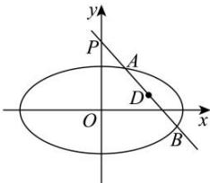

> [!faq]- 全练一本通解析
> **【解析】**
> （1） $\frac{x^{2}}{2}+y^{2}=1$ ; $e=\frac{\sqrt{2}}{2}$ . （2）点 D 在定直线 $y=\frac{1}{2}$ 上解析：（1）由椭圆的定义知， $\left|MF_{1}\right|+\left|MF_{2}\right|=2\sqrt{2}=2\sqrt{m}$ ，故 m=2，所以椭圆 C 的方程为 $\frac{x^{2}}{2}+y^{2}=1$ ，故 $a=\sqrt{2}, b=1, c=\sqrt{a^{2}-b^{2}}=1$ ，所以椭圆 C 的离心率为 $e=\frac{c}{a}=\frac{1}{\sqrt{2}}=\frac{\sqrt{2}}{2}$ .
> （2）若直线 l 的斜率存在，设直线 l 的方程为： $y=kx+2$ ，
> 则联立 $\left\{\begin{aligned}&y=kx+2\\&\frac{x^{2}}{2}+y^{2}=1\end{aligned}\right.$ 可得： $\left(1+2k^{2}\right)x^{2}+8kx+6=0$ ，
> 则 $\Delta=64k^{2}-24(2k^{2}+1)=16k^{2}-24>0$ ，解得： $k^{2}>\frac{3}{2}$ 设 $A(x_{1},y_{1})$ ， $B(x_{2},y_{2})$ ，则 $x_{1}+x_{2}=\frac{-8k}{2k^{2}+1}$ ， $x_{1}x_{2}=\frac{6}{2k^{2}+1}$ ，
> 由 $\overline{PA}=t\overline{PB}$ 可得： $(x_{1},y_{1}-2)=t(x_{2},y_{2}-2)$ ，即 $\frac{x_{1}}{x_{2}}=\frac{y_{1}-2}{y_{2}-2}=t$ ，
> 设 $D(x_{0},y_{0})$ ，由 $\overline{AD}=t\overline{DB}$ 可得： $(x_{0}-x_{1},y_{0}-y_{1})=t(x_{2}-x_{0},y_{2}-y_{0})$ ，
> 即 $x_{0}-x_{1}=\frac{x_{1}}{x_{2}}(x_{2}-x_{0})$ ，即 $x_{2}x_{0}-x_{1}x_{2}=x_{1}x_{2}-x_{1}x_{0}$
> 
> 则 $x_{0}=\frac{2x_{1}x_{2}}{x_{1}+x_{2}}=\frac{\frac{12}{2k^{2}+1}}{\frac{-8k}{2k^{2}+1}}=\frac{3}{-2k}$ ,
> 因为点 D 在直线 l 上, 所以 $y_{0}=kx_{0}+2=k\cdot\frac{3}{-2k}+2=\frac{1}{2}$ ,
> 所以点 D 在定直线 $y=\frac{1}{2}$ 上,
> 若直线 l 的斜率不存在, 过 P 的直线 l 与椭圆 C 交于 A、B 两点, $A(0,1), B(0,-1), \overline{PA}=(0,-1)=t\overline{PB}=t(0,-3)$ , 所以 $t=\frac{1}{3}$ ,
> 则 $\overrightarrow{AD}=(x_{0},y_{0}-1)=\frac{1}{3}\overrightarrow{DB}=\frac{1}{3}(-x_{0},-1-y_{0})$ ,
> 所以 $y_{0}-1=\frac{1}{3}(-1-y_{0})$ ，解得： $y_{0}=\frac{1}{2}$ ，满足点 D 在定直线 $y=\frac{1}{2}$ 上.
