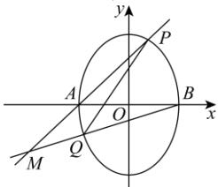

> [!faq]- 全练一本通解析
> **【解析】**
> （1） $\frac{x^{2}}{4}+\frac{y^{2}}{8}=1$ （2）点 M 在定直线 x=-4 上
> 解析：（1）设椭圆 E 的方程为 $mx^{2}+ny^{2}=1(m>0,n>0)$ .
> 则 $\left\{\begin{aligned}&4m=1\\&m+6n=1\end{aligned}\right.$ ，解得 $\left\{\begin{aligned}&m=\frac{1}{4}\\&n=\frac{1}{8}\end{aligned}\right.$ 故椭圆 E 的方程为 $\frac{x^{2}}{4}+\frac{y^{2}}{8}=1$ .
> （2）依题可设直线 l 的方程为 x=my-1， $P(x_{1},y_{1})$ ， $Q(x_{2},y_{2})$ ， $M(x_{0},y_{0})$ .
> 联立方程组 $\left\{\begin{aligned}&x=my-1\\&\frac{x^{2}}{4}+\frac{y^{2}}{8}=1\end{aligned}\right.$ ，整理得 $(2m^{2}+1)y^{2}-4my-6=0$ ，
> 则 $y_{1} + y_{2} = \frac{4m}{2m^{2} + 1}$ ， $y_{1}y_{2} = \frac{-6}{2m^{2} + 1}$
> 
> 直线 $AP$ 的方程为 $y = \frac{y_1}{x_1 + 2}(x + 2)$ ，直线 $BQ$ 的方程为 $y = \frac{y_2}{x_2 - 2}(x - 2)$
> 联立方程组 $\left\{ \begin{array}{l} y = \frac{y_1}{x_1 + 2}(x + 2) \\ y = \frac{y_2}{x_2 - 2}(x - 2) \end{array} \right.$ ，得 $x_0 = \frac{2y_1x_2 - 4y_1 + 2x_1y_2 + 4y_2}{(x_1 + 2)y_2 - (x_2 - 2)y_1} = \frac{4my_1y_2 - 6y_1 + 2y_2}{3y_1 + y_2}$ 由 $y_{1} + y_{2} = \frac{4m}{2m^{2} + 1}$ ，得 $y_{1}y_{2} = \frac{-6}{2m^{2} + 1}$ ，得 $2my_1y_2 = -3(y_1 + y_2)$ . 所以 $x_0 = \frac{4my_1y_2 - 6y_1 + 2y_2}{3y_1 + y_2} = \frac{-6(y_1 + y_2) - 6y_1 + 2y_2}{3y_1 + y_2} = \frac{-12y_1 - 4y_2}{3y_1 + y_2} = -4$ 故点 $M$ 在定直线 $x = -4$ 上.
